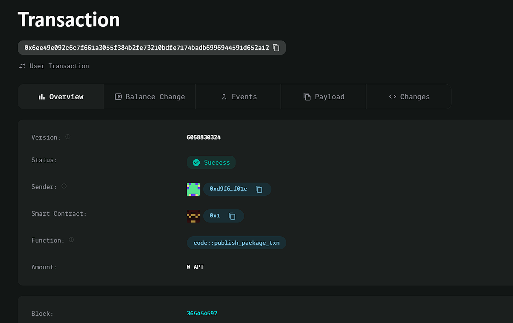

### Deployed smartcontract address: 0x6ee49e092c6c7f661a3055f384b2fe73210bdfe7174badb6996944591d652a12

### Screenshot:

# Decentralized Music Streaming Platform

## Project Title
Decentralized Music Streaming Platform

## Project Description
The Decentralized Music Streaming Platform allows artists to upload their music directly onto the blockchain, enabling listeners to stream songs while paying royalties instantly through smart contracts. The platform eliminates intermediaries, ensuring that artists receive their earnings fairly and immediately.

## Vision
Our vision is to create a fair, transparent, and decentralized music streaming ecosystem where artists are compensated instantly for their work. By leveraging blockchain technology, we eliminate the need for intermediaries, allowing artists to have full control over their music and earnings.

## Key Features
- **Direct Music Upload**: Artists can upload their music and set a price for streaming directly on the platform.
- **Instant Royalties**: Listeners pay royalties to artists instantly via smart contracts when streaming music.
- **Fair Compensation**: Payments are transparent and go directly to the artist without intermediaries.
- **Immutable Records**: Music and royalty payments are recorded on the blockchain, providing transparency and accountability.

## Future Scope
- **Subscription Model**: Implement a subscription service where users can pay monthly fees for unlimited streaming, with royalties distributed to artists.
- **NFT Music**: Allow artists to mint their music as NFTs, granting ownership rights or exclusive access.
- **Artist Profiles**: Provide artists with customizable profiles to showcase their work and interact with their audience.
- **Analytics and Insights**: Build analytics features to provide artists with insights on listener engagement and revenue.
- **Collaborative Playlists**: Create collaborative playlist features where listeners can create and share playlists while compensating artists for each stream.

